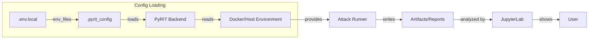
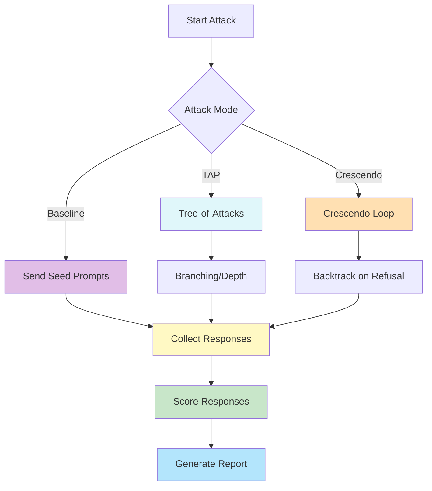
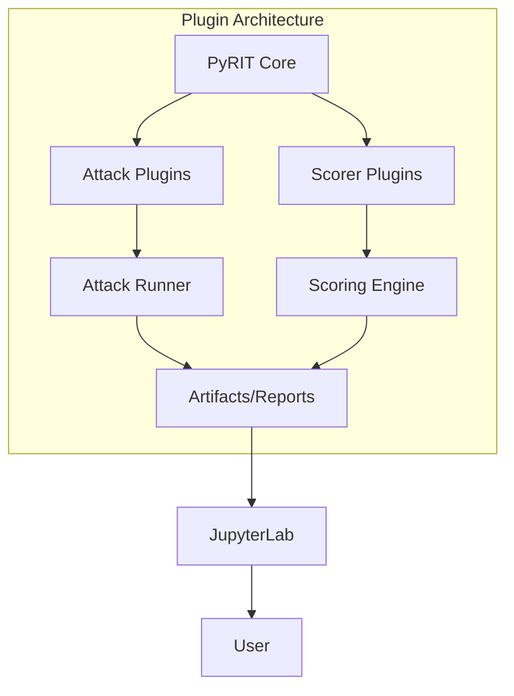

# Python Risk Identification Tool for generative AI (PyRIT)

The Python Risk Identification Tool for generative AI (PyRIT) is an open
access automation framework to empower security professionals and ML
engineers to red team foundation models and their applications.

## Introduction

PyRIT is a library developed by the AI Red Team for researchers and engineers
to help them assess the robustness of their LLM endpoints against different
harm categories such as fabrication/ungrounded content (e.g., hallucination),
misuse (e.g., bias), and prohibited content (e.g., harassment).

PyRIT automates AI Red Teaming tasks to allow operators to focus on more
complicated and time-consuming tasks and can also identify security harms such
as misuse (e.g., malware generation, jailbreaking), and privacy harms
(e.g., identity theft).​

The goal is to allow researchers to have a baseline of how well their model
and entire inference pipeline is doing against different harm categories and
to be able to compare that baseline to future iterations of their model.
This allows them to have empirical data on how well their model is doing
today, and detect any degradation of performance based on future improvements.

Additionally, this tool allows researchers to iterate and improve their
mitigations against different harms.
For example, at Microsoft we are using this tool to iterate on different
versions of a product (and its metaprompt) so that we can more effectively
protect against prompt injection attacks.


## Visual Architecture Diagram

This diagram shows how the host machine, the unified Docker container, the database, and Ollama server interact in the security evaluator setup. The host mounts the repo into the container, which runs the PyRIT CLI and JupyterLab. Both use the same SQLite database file and communicate with the Ollama server for LLM inference.

```mermaid
flowchart TD
    A[User Machine / Host] -->|Volume Mount| B[/Unified Security Evaluator Container/]
    B --> C[PyRIT CLI]
    B --> D[JupyterLab]
    B --> E[Shared SQLite DB (reports/pyrit_ollama_demo.db)]
    C --> F
    D --> E
    A --> G[Ollama Server]
    C --> G
    D --> G
    subgraph Docker Compose
      B
    end
```

## Config Loading and Data Flow

This diagram illustrates how configuration files (`.env.local` and `.pyrit_config`) are loaded into the backend, how environment variables are set, and how the attack runner produces artifacts and reports that are then analyzed in Jupyter or downstream reporting tools, ultimately presenting results to the user.



## Where can I learn more?

Microsoft Learn has a
[dedicated page on AI Red Teaming](https://learn.microsoft.com/en-us/security/ai-red-team).

Check out our [docs](https://github.com/Azure/PyRIT/blob/main/doc/README.md) for more information
on how to [install PyRIT](https://github.com/Azure/PyRIT/blob/main/doc/setup/install_pyrit.md),
our [How to Guide](https://github.com/Azure/PyRIT/blob/main/doc/how_to_guide.ipynb),
and more, as well as our [demos](https://github.com/Azure/PyRIT/tree/main/doc/demo) folder.

For the security evaluator sample, use the dedicated user guide at [samples/security-evaluator/docs/SECURITY_EVALUATOR_USER_GUIDE.md](samples/security-evaluator/docs/SECURITY_EVALUATOR_USER_GUIDE.md) for a full, sequential walkthrough.

## Quick Start

1. **Run the onboarding wizard:**
   ```bash
   python samples/security-evaluator/scripts/helper/onboarding_wizard.py
   ```
2. **Try the Jupyter notebook quickstart:**
   Open `notebooks/Redteam_Quickstart_Template.ipynb` in JupyterLab.
3. **Generate a Markdown report:**
   ```bash
   python samples/security-evaluator/scripts/helper/generate_markdown_report.py
   ```

## Example .env.local
```ini
OLLAMA_ENDPOINT=http://localhost:11434/v1
OLLAMA_TARGET_MODEL=llama3.2
OLLAMA_ATTACKER_MODEL=mistral
OLLAMA_CONVERTER_MODEL=phi3
OLLAMA_TF_SCORER_MODEL=phi3
OLLAMA_SCALE_SCORER_MODEL=llama2
OLLAMA_REFUSAL_SCORER_MODEL=mistral
OLLAMA_SCORER_MODEL=phi3
PYRIT_SQLITE_DB_PATH=reports/pyrit_ollama_demo.db
```

## Example .pyrit_config
```yaml
memory_db_type: sqlite
operator: local_redteam
operation: owasp_ollama_example
initializers: []
env_files:
  - ./.env.local
silent: false
```

## Trademarks

This project may contain trademarks or logos for projects, products, or services.
Authorized use of Microsoft trademarks or logos is subject to and must follow
[Microsoft's Trademark & Brand Guidelines](https://www.microsoft.com/en-us/legal/intellectualproperty/trademarks/usage/general).
Use of Microsoft trademarks or logos in modified versions of this project must
not cause confusion or imply Microsoft sponsorship.
Any use of third-party trademarks or logos are subject to those third-party's
policies.

---

## Attack Mode Flow

This diagram explains the logic for the three main attack modes:
- **Baseline**: Sends seed prompts, collects and scores responses, and generates a report.
- **TAP (Tree-of-Attacks)**: Builds a branching attack tree, collects responses at each node, and scores them.
- **Crescendo**: Iteratively attacks, backtracking on refusals, then collects and scores responses.
All modes converge on report generation and analysis.



This diagram shows the flow for Baseline, TAP, and Crescendo attack modes.

---

## Plugin Architecture (Extensibility)

This diagram shows how PyRIT can be extended with custom attack and scorer plugins. The core loads plugins, which feed into the attack runner and scoring engine. Results are written to artifacts/reports, which are then visualized in the GUI or Jupyter for the user.


