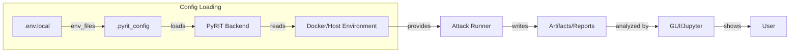
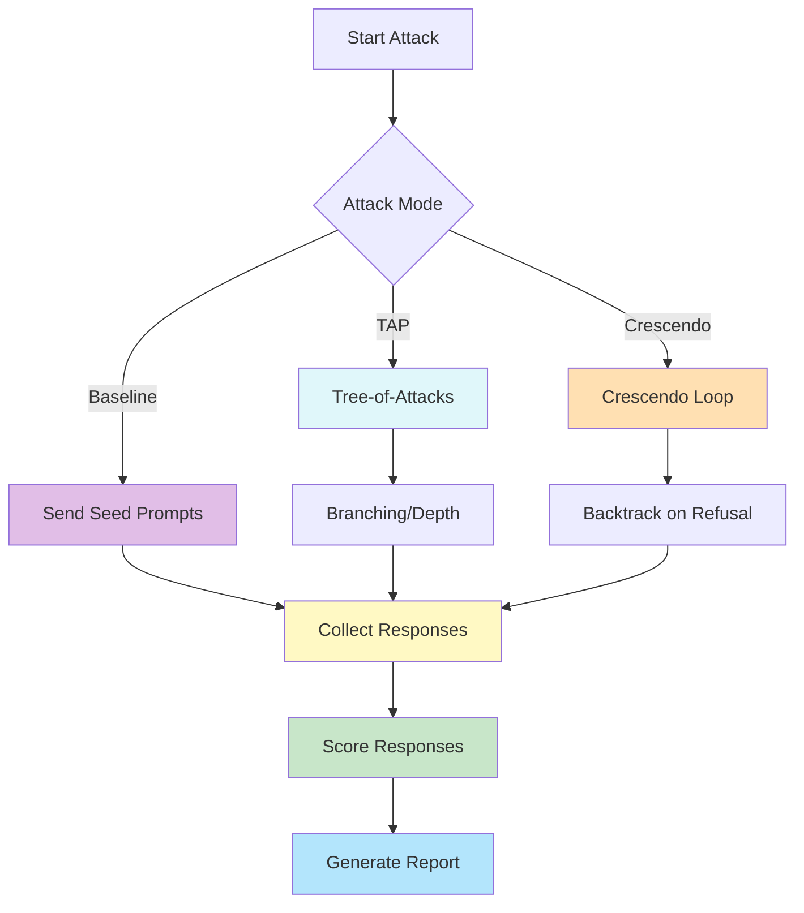
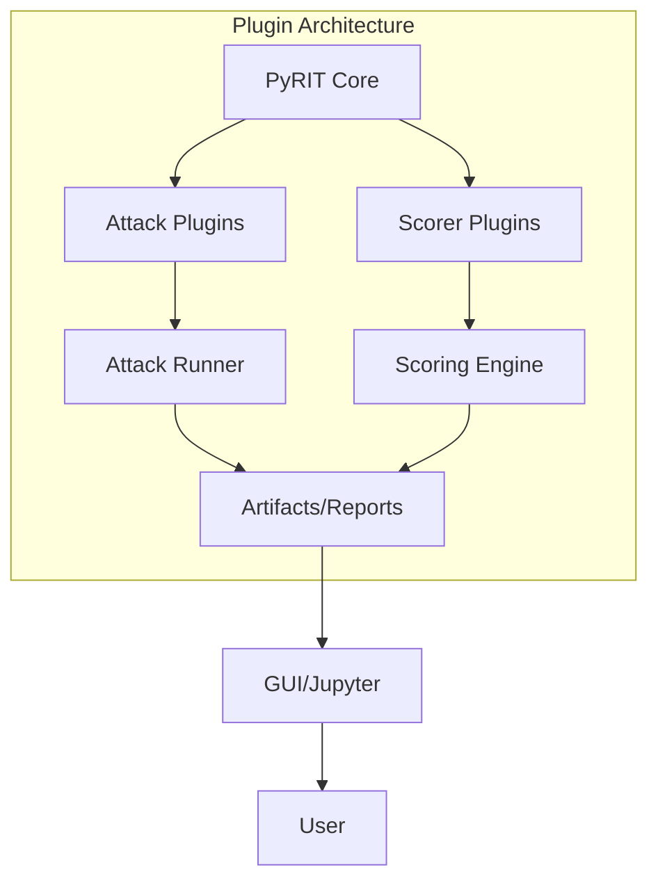

# PyRIT Environment Configuration Guide

Complete reference for configuring PyRIT's environment variables and configuration files for `security-evaluator`.

---

## Table of Contents

1. [Configuration Files](#configuration-files)
2. [Environment Variables Reference](#environment-variables-reference)
3. [Default Values](#default-values)
4. [Docker Compose Environment](#docker-compose-environment)
5. [Quick Start Examples](#quick-start-examples)
6. [Troubleshooting](#troubleshooting)

---

## Configuration Files

### `.env.local`

Contains model endpoints, feature toggles, and runtime parameters. **Required** for running PyRIT.

**Location**: Root of `samples/security-evaluator/` directory

**Example**:
```bash
cp config/.env.local.example .env.local
```

**What it controls**:
- Model endpoints (Ollama, OpenAI, Azure, etc.)
- Model names for different roles (target, attacker, scorers)
- Artifact output paths
- Runtime behavior (debug, retries, dataset limits)
- Attack-mode specific parameters (TAP depth, Crescendo backtracks)

---

### `.pyrit_config`

Configures PyRIT's core infrastructure (memory backend, operators, logging).

**Location**: Root of `samples/security-evaluator/` directory OR `~/.pyrit/.pyrit_config` (user-wide)

**Example**:
```yaml
memory_db_type: sqlite
operator: local_redteam
operation: owasp_ollama_example
initializers: []
env_files:
  - ./.env.local
silent: false
```

**What it controls**:
- Memory backend type (sqlite, cosmos, sql)
- Operation metadata (operator name, operation name)
- Cloud service initializers (Azure, OpenAI, etc.)
- Environment file references
- Logging verbosity

---

## Environment Variables Reference

### OLLAMA Model Configuration

These variables define which models are used in your red-teaming workflow.

| Variable | Default | Purpose |
|----------|---------|---------|
| `OLLAMA_ENDPOINT` | `http://localhost:11434/v1` | Ollama API endpoint (must include `/v1` path) |
| `OLLAMA_TARGET_MODEL` | `llama3.2` | Model being tested (red team target) |
| `OLLAMA_ATTACKER_MODEL` | `mistral` | Model generating adversarial prompts |
| `OLLAMA_CONVERTER_MODEL` | `phi3` | Model for LLM-based prompt conversions |
| `OLLAMA_TF_SCORER_MODEL` | `phi3` | True/False response scorer (distinct) |
| `OLLAMA_SCALE_SCORER_MODEL` | `llama2` | Float-scale response scorer (different model) |
| `OLLAMA_REFUSAL_SCORER_MODEL` | `mistral` | Refusal detection scorer (different model) |
| `OLLAMA_SCORER_MODEL` | `phi3` | Generic fallback scorer |
| `OLLAMA_MODEL` | `llama2` | Optional generic Ollama model (used by some examples) |
| `ALLOW_REMOTE_OLLAMA_ENDPOINT` | `false` | Set `true` only for trusted remote Ollama hosts |

**Note**: When running locally, keep `OLLAMA_ENDPOINT=http://localhost:11434/v1` and `ALLOW_REMOTE_OLLAMA_ENDPOINT=false` for security.

---

### SQLite Database

Controls where PyRIT stores conversation history, artifacts, and scores.

| Variable | Default | Purpose |
|----------|---------|---------|
| `PYRIT_SQLITE_DB_PATH` | `reports/pyrit_ollama_demo.db` | Main PyRIT database file (relative to repo root) |

**Important**: In Docker, this path is absolute: `/workspace/samples/security-evaluator/reports/pyrit_ollama_demo.db` (via volume mount)

---

### Output and Artifact Paths

Where PyRIT writes results, logs, and generated reports.

| Variable | Default | Purpose |
|----------|---------|---------|
| `ARTIFACTS_ROOT_PATH` | `reports` | Base folder for all run artifacts |
| `LOGS_ROOT_PATH` | `logs` | Folder for logs, checkpoints, debug output |
| `SCORER_COMPARISON_CSV_PATH` | `reports/scorer_comparison.csv` | Flattened scorer comparison CSV |
| `SCORER_OUTPUTS_JSON_PATH` | `reports/scorer_outputs.json` | Detailed scorer results JSON |
| `BATCH_SCORER_CHECK_JSON_PATH` | `reports/batch_scorer_check.json` | Batch rescore metadata file |
| `RUN_REPORT_JSON_PATH` | `reports/run_report.json` | Consolidated run summary |
| `REPORTS_ROOT_PATH` | `reports/cases` | Top-level reports directory |
| `BASELINE_REPORT_PATH` | `reports/baseline_scan_report.json` | Baseline scan results (for baseline attack mode) |

---

### Runtime Behavior

Control how PyRIT runs, retries, and recovers.

| Variable | Default | Purpose |
|----------|---------|---------|
| `DEBUG` | `false` | Enable debug-level logging in runner output |
| `ALLOW_RUNTIME_PIP_INSTALL` | `false` | Auto-install missing Python packages at runtime |
| `PYRIT_MAX_TURNS` | `4` | Maximum conversation turns per red-team scenario (1..20) |
| `PRINT_DATASET_SEEDS` | `false` | Print sample rows from loaded datasets |
| `DATASET_PREVIEW_ROWS` | `3` | Number of seed rows to preview (0..20) |
| `EXPORT_DETAILED_SCORES_JSON` | `true` | Export detailed scoring JSON in addition to summary |
| `RUN_ALL_AVAILABLE_DATASETS` | `false` | Run every available dataset (expensive, usually false) |
| `MAX_DATASETS_PER_SCENARIO` | `0` | Limit datasets per scenario (0 = no limit) |
| `OLLAMA_MAX_RETRIES_PER_SCENARIO` | `3` | Retry attempts per scenario (1..10) |
| `OLLAMA_RETRY_WAIT_SECONDS` | `5` | Wait seconds between retries (1..120) |
| `RESUME_INCOMPLETE_RUN` | `true` | Resume from checkpoint if interrupted |

---

### Attack Mode: TAP (Tree-of-Attacks with Pruning)

Used when running: `python app/main.py --attack-mode tap`

| Variable | Default | Purpose |
|----------|---------|---------|
| `TAP_WIDTH` | `3` | Number of parallel attack branches per scenario |
| `TAP_BRANCHING_FACTOR` | `2` | Child nodes per branch at each depth level |
| `TAP_DEPTH` | `5` | Maximum depth of each attack tree |

**Cost**: Width × Branching^Depth (can grow exponentially; start conservative)

---

### Attack Mode: Crescendo

Used when running: `python app/main.py --attack-mode crescendo`

| Variable | Default | Purpose |
|----------|---------|---------|
| `CRESCENDO_MAX_BACKTRACKS` | `5` | Max backtracks after model refusal |
| `CRESCENDO_MAX_TURNS` | `10` | Maximum conversation turns for crescendo attacks |

---

### Attack Mode: Baseline

Used when running: `python app/main.py --attack-mode baseline`

| Variable | Default | Purpose |
|----------|---------|---------|
| `BASELINE_MAX_SEEDS` | `0` | Max seed prompts to send per scenario (0 = unlimited) |

---

## Default Values

### Complete `.env.local` Example

```bash
# ━━━━━━━━━━━━━━━━━━━━━━━━━━━━━━━━━━━━━━━━━━━━━━━━━━━━━━━━━━━━━━━━━━━━━━
# OLLAMA MODEL CONFIGURATION
# ━━━━━━━━━━━━━━━━━━━━━━━━━━━━━━━━━━━━━━━━━━━━━━━━━━━━━━━━━━━━━━━━━━━━━━
OLLAMA_ENDPOINT=http://localhost:11434/v1
OLLAMA_TARGET_MODEL=llama3.2
OLLAMA_ATTACKER_MODEL=mistral
OLLAMA_CONVERTER_MODEL=phi3
OLLAMA_TF_SCORER_MODEL=phi3
OLLAMA_SCALE_SCORER_MODEL=llama2
OLLAMA_REFUSAL_SCORER_MODEL=mistral
OLLAMA_SCORER_MODEL=phi3
OLLAMA_MODEL=llama2
ALLOW_REMOTE_OLLAMA_ENDPOINT=false

# ━━━━━━━━━━━━━━━━━━━━━━━━━━━━━━━━━━━━━━━━━━━━━━━━━━━━━━━━━━━━━━━━━━━━━━
# SQLITE DATABASE
# ━━━━━━━━━━━━━━━━━━━━━━━━━━━━━━━━━━━━━━━━━━━━━━━━━━━━━━━━━━━━━━━━━━━━━━
PYRIT_SQLITE_DB_PATH=reports/pyrit_ollama_demo.db

# ━━━━━━━━━━━━━━━━━━━━━━━━━━━━━━━━━━━━━━━━━━━━━━━━━━━━━━━━━━━━━━━━━━━━━━
# OUTPUT AND ARTIFACT PATHS
# ━━━━━━━━━━━━━━━━━━━━━━━━━━━━━━━━━━━━━━━━━━━━━━━━━━━━━━━━━━━━━━━━━━━━━━
ARTIFACTS_ROOT_PATH=reports
LOGS_ROOT_PATH=logs
SCORER_COMPARISON_CSV_PATH=reports/scorer_comparison.csv
SCORER_OUTPUTS_JSON_PATH=reports/scorer_outputs.json
BATCH_SCORER_CHECK_JSON_PATH=reports/batch_scorer_check.json
RUN_REPORT_JSON_PATH=reports/run_report.json
REPORTS_ROOT_PATH=reports/cases

# ━━━━━━━━━━━━━━━━━━━━━━━━━━━━━━━━━━━━━━━━━━━━━━━━━━━━━━━━━━━━━━━━━━━━━━
# RUNTIME BEHAVIOR
# ━━━━━━━━━━━━━━━━━━━━━━━━━━━━━━━━━━━━━━━━━━━━━━━━━━━━━━━━━━━━━━━━━━━━━━
DEBUG=false
ALLOW_RUNTIME_PIP_INSTALL=false
PYRIT_MAX_TURNS=4
PRINT_DATASET_SEEDS=false
DATASET_PREVIEW_ROWS=3
EXPORT_DETAILED_SCORES_JSON=true
RUN_ALL_AVAILABLE_DATASETS=false
MAX_DATASETS_PER_SCENARIO=0
OLLAMA_MAX_RETRIES_PER_SCENARIO=3
OLLAMA_RETRY_WAIT_SECONDS=5
RESUME_INCOMPLETE_RUN=true

# ━━━━━━━━━━━━━━━━━━━━━━━━━━━━━━━━━━━━━━━━━━━━━━━━━━━━━━━━━━━━━━━━━━━━━━
# ATTACK MODE: TAP
# ━━━━━━━━━━━━━━━━━━━━━━━━━━━━━━━━━━━━━━━━━━━━━━━━━━━━━━━━━━━━━━━━━━━━━━
TAP_WIDTH=3
TAP_BRANCHING_FACTOR=2
TAP_DEPTH=5

# ━━━━━━━━━━━━━━━━━━━━━━━━━━━━━━━━━━━━━━━━━━━━━━━━━━━━━━━━━━━━━━━━━━━━━━
# ATTACK MODE: Crescendo
# ━━━━━━━━━━━━━━━━━━━━━━━━━━━━━━━━━━━━━━━━━━━━━━━━━━━━━━━━━━━━━━━━━━━━━━
CRESCENDO_MAX_BACKTRACKS=5
CRESCENDO_MAX_TURNS=10

# ━━━━━━━━━━━━━━━━━━━━━━━━━━━━━━━━━━━━━━━━━━━━━━━━━━━━━━━━━━━━━━━━━━━━━━
# ATTACK MODE: Baseline
# ━━━━━━━━━━━━━━━━━━━━━━━━━━━━━━━━━━━━━━━━━━━━━━━━━━━━━━━━━━━━━━━━━━━━━━
BASELINE_MAX_SEEDS=0
BASELINE_REPORT_PATH=reports/baseline_scan_report.json
```

### Complete `.pyrit_config` Example

```yaml
memory_db_type: sqlite

operator: local_redteam
operation: owasp_ollama_example

initializers: []

env_files:
  - ./.env.local

silent: false
```

---

## Docker Compose Environment

When running in Docker, environment variables are set in `docker-compose.yaml`:

```yaml
services:
  copyrit:
    environment:
      # OLLAMA Models
      OLLAMA_ENDPOINT: http://host.docker.internal:11434/v1
      OLLAMA_TARGET_MODEL: llama3.2
      OLLAMA_ATTACKER_MODEL: mistral
      OLLAMA_CONVERTER_MODEL: phi3
      OLLAMA_TF_SCORER_MODEL: phi3
      OLLAMA_SCALE_SCORER_MODEL: phi3
      OLLAMA_REFUSAL_SCORER_MODEL: phi3
      OLLAMA_SCORER_MODEL: phi3
      OLLAMA_MODEL: llama2
      ALLOW_REMOTE_OLLAMA_ENDPOINT: "false"
      
      # SQLite
      PYRIT_SQLITE_DB_PATH: /workspace/samples/security-evaluator/reports/pyrit_ollama_demo.db
      
      # Output Paths
      ARTIFACTS_ROOT_PATH: /workspace/samples/security-evaluator/reports
      LOGS_ROOT_PATH: /workspace/samples/security-evaluator/logs
      SCORER_COMPARISON_CSV_PATH: /workspace/samples/security-evaluator/reports/scorer_comparison.csv
      SCORER_OUTPUTS_JSON_PATH: /workspace/samples/security-evaluator/reports/scorer_outputs.json
      
      # Runtime
      DEBUG: "false"
      ALLOW_RUNTIME_PIP_INSTALL: "false"
      PYRIT_MAX_TURNS: "4"
      RESUME_INCOMPLETE_RUN: "true"
      
      # Attack Modes
      TAP_WIDTH: "3"
      TAP_BRANCHING_FACTOR: "2"
      TAP_DEPTH: "5"
      CRESCENDO_MAX_BACKTRACKS: "5"
      CRESCENDO_MAX_TURNS: "10"
      BASELINE_MAX_SEEDS: "0"
```

**Key difference**: Paths in Docker use absolute paths starting with `/workspace/` (volume mount destination), not relative paths.

---

## Quick Start Examples

### Example 1: Local Setup with Ollama

```bash
# 1. Copy default env file
cd samples/security-evaluator
cp config/.env.local.example .env.local

# 2. Verify configuration
python scripts/helper/verification/validate_redteam_config.py

# 3. Run baseline attack (reads .env.local, uses .pyrit_config defaults)
python scripts/app/main.py --attack-mode baseline --dry-run
```

### Example 2: Docker Setup with Compose

```bash
# 1. Start containers (env vars in docker-compose.yaml)
docker-compose -f samples/security-evaluator/docker-compose.yaml up -d

# 2. Enter copyrit container
docker-compose -f samples/security-evaluator/docker-compose.yaml exec copyrit bash

# 3. Inside container, env vars are already set
echo $OLLAMA_ENDPOINT
echo $PYRIT_SQLITE_DB_PATH

# 4. Run attack (uses environment + .pyrit_config)
python /workspace/samples/security-evaluator/scripts/app/main.py --attack-mode tap
```

### Example 3: Custom Model Configuration

Modify `.env.local` to use different models:

```bash
# Use more advanced models (if available in Ollama)
OLLAMA_TARGET_MODEL=mistral
OLLAMA_ATTACKER_MODEL=neural-chat
OLLAMA_CONVERTER_MODEL=phi3
OLLAMA_TF_SCORER_MODEL=mistral

# Increase retry tolerance
OLLAMA_MAX_RETRIES_PER_SCENARIO=5
OLLAMA_RETRY_WAIT_SECONDS=10

# Customize TAP attack depth
TAP_DEPTH=7
TAP_WIDTH=4
```

### Example 4: Cloud Service Integration

To use Azure OpenAI or other cloud providers:

**`.pyrit_config`**:
```yaml
memory_db_type: sqlite
operator: cloud_redteam
operation: azure_validation
initializers:
  - azure_auth  # Add cloud initializer
env_files:
  - ./.env.local
silent: false
```

**`.env.local`** (add cloud variables):
```bash
# Keep existing local config
OLLAMA_ENDPOINT=http://localhost:11434/v1
OLLAMA_TARGET_MODEL=llama3.2

# Add cloud service variables
AZURE_OPENAI_KEY=your-key-here
AZURE_OPENAI_ENDPOINT=https://your-resource.openai.azure.com/
AZURE_OPENAI_DEPLOYMENT=gpt-4o
```

---

## Quick Setup: PyRIT & CoPyRIT Combined Docker Image

A single Docker image for rapid evaluation and demo of both PyRIT and CoPyRIT (JupyterLab + Streamlit GUI) is provided.

### Build the Image

```bash
cd samples/security-evaluator
# Build the combined image
docker compose build pyrit-copyrit-quick
```

### Run the Container

```bash
# Start the container (JupyterLab on 8888, Streamlit GUI on 8501)
docker compose up pyrit-copyrit-quick
```

- JupyterLab: http://localhost:8888
- CoPyRIT Streamlit GUI: http://localhost:8501

The container includes all environment variables and mounts the repo for full access to data and scripts.

---

## Config Loading and Data Flow



This diagram shows the flow from configuration files to backend, runner, and reporting/GUI.

---

## Attack Mode Flow



This diagram shows the logic for Baseline, TAP, and Crescendo attack modes.

---

## Plugin Architecture (Extensibility)



This diagram shows how plugins extend PyRIT for custom attacks and scoring.

---

## Troubleshooting

### Issue: "Missing required variable in .env.local: OLLAMA_ENDPOINT"

**Solution**: Run configuration helper:
```bash
python scripts/helper/verification/validate_redteam_config.py --fix
```

This copies defaults from `config/.env.local.example` to `.env.local`.

---

### Issue: "OLLAMA_ENDPOINT should end with /v1"

**Solution**: Ensure endpoint has `/v1` path:
```bash
# ✗ Wrong
OLLAMA_ENDPOINT=http://localhost:11434

# ✓ Correct
OLLAMA_ENDPOINT=http://localhost:11434/v1
```

---

### Issue: Container can't find database

**Solution**: Check volume mount in docker-compose:
```yaml
volumes:
  - ../../:/workspace  # Correct: binds repo root
```

And verify path:
```bash
PYRIT_SQLITE_DB_PATH=/workspace/samples/security-evaluator/reports/pyrit_ollama_demo.db
```

---

### Issue: "Connection refused" when accessing Ollama from Docker

**Solution**: Use `host.docker.internal` on Mac/Windows, or `host.gateway` on Linux:
```yaml
environment:
  OLLAMA_ENDPOINT: http://host.docker.internal:11434/v1  # Mac/Windows

# Linux: Use host gateway
extra_hosts:
  - "host.docker.internal:host-gateway"
```

---

## See Also

- [SECURITY_EVALUATOR_USER_GUIDE.md](SECURITY_EVALUATOR_USER_GUIDE.md) - Complete runner guide
- [setup/local_setup.md](setup/local_setup.md) - Local installation guide
- [setup/docker_setup.md](setup/docker_setup.md) - Docker setup guide
- `config/.env.local.example` - Full environment template
- `config/.pyrit_config.example` - Full configuration example

---

## Visual Architecture Diagram

This diagram shows how the host machine, Docker containers, database, and Ollama server interact in the security evaluator setup. The host mounts the repo into the container, which runs PyRIT CLI, CoPyRIT GUI, and JupyterLab. All tools share the same SQLite database file and communicate with the Ollama server for LLM inference.

---

## Config Loading and Data Flow

This diagram illustrates how configuration files (`.env.local` and `.pyrit_config`) are loaded into the backend, how environment variables are set, and how the attack runner produces artifacts and reports that are then analyzed by the GUI or Jupyter, ultimately presenting results to the user.

---

## Attack Mode Flow

This diagram explains the logic for the three main attack modes:
- **Baseline**: Sends seed prompts, collects and scores responses, and generates a report.
- **TAP (Tree-of-Attacks)**: Builds a branching attack tree, collects responses at each node, and scores them.
- **Crescendo**: Iteratively attacks, backtracking on refusals, then collects and scores responses.
All modes converge on report generation and analysis.

---

## Plugin Architecture (Extensibility)

This diagram shows how PyRIT can be extended with custom attack and scorer plugins. The core loads plugins, which feed into the attack runner and scoring engine. Results are written to artifacts/reports, which are then visualized in the GUI or Jupyter for the user.
